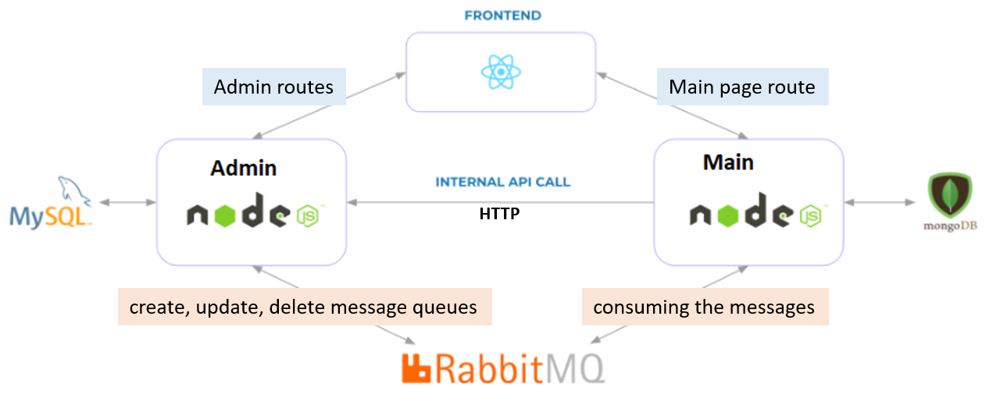

# Microservices with RabbitMQ

## How to run the system
- Create a free RabbitMQ message queue here: https://www.cloudamqp.com/
- Use the RabbitMQ connection string in both admin and main microservice to connect to your cloud message queue: create .env file for both microservices and set: RABBIT_MQ_URL=<rabbitmq_url>
- You can also run docker-compose up to run RabbitMQ locally. Then you can access the gui at http://localhost:15673/ and use the default username and password: guest/guest
- install dependencies in all 3 apps (admin, main, react-frontend).
- Run tsc compiler for both admin and main microservice (to generate JavaScript files)
- Open 3 terminals and start all three apps.
- Go to http://localhost:3000 - the main react-frontend page
- Go to http://localhost:3000/admin/products - the admin page for products


System Architecture:



- admin: node.js express server in TypeScript using MySQL database (using TypeORM). Port 8000
- main: node.js express server in TypeScript using MongoDB database (using TypeORM). Port 8001
- react-frontend: React client. Port 3000

React client talks with main server via REST API. 

Main server and admin server communicate via RabbitMQ but there is also an internal HTTP communication between them.

## React client
React client has 2 parts:
- main page: Showing the products and a like button for each product.
- admin page (with forms for editing and creating new products)

### Main page:
HTTP communication with the main server microservice.

Showing all products + like button:
```tsx
const Main = () => {
    const [products, setProducts] = useState([] as Product[]);

    useEffect(() => {
        (
            async () => {
                const response = await fetch('http://localhost:8001/api/products');

                const data = await response.json();

                setProducts(data);
            }
        )();
    }, []);

    const like = async (id: number) => {
        await fetch(`http://localhost:8001/api/products/${id}/like`, {
            method: 'POST',
            headers: {'Content-Type': 'application/json'}
        });
```

### Admin product page: Admin can see, add, edit, and delete products.
HTTP communication with the admin server microservice.

Getting and deleting products from the admin microservice: http://localhost:3000/admin/products
```tsx
const Products = () => {
    const [products, setProducts] = useState([]);

    useEffect(() => {
        (
            async () => {
                const response = await fetch('http://localhost:8000/api/products');

                const data = await response.json();

                setProducts(data);
            }
        )();
    }, []);

    const del = async (id: number) => {
        if (window.confirm('Are you sure you want to delete this product?')) {
            await fetch(`http://localhost:8000/api/products/${id}`, {
                method: 'DELETE'
            });

            setProducts(products.filter((p: Product) => p.id !== id));
        }
    }
```

Adding a product:
```tsx
await fetch('http://localhost:8000/api/products', {
    method: 'POST',
    headers: {'Content-Type': 'application/json'},
    body: JSON.stringify({
        title,
        image
    })
});
```

Editing a product:
```tsx
await fetch(`http://localhost:8000/api/products/${props.match.params.id}`, {
    method: 'PUT',
    headers: {'Content-Type': 'application/json'},
    body: JSON.stringify({
        title,
        image
    })
});
```

TODO: Create a proper menu with LINKs to the components. Refactor the code.


## Admin server microservice
MySQL database with TypeORM.

Config:
```json
{
  "type": "mysql",
  "host": "localhost",
  "port": 3306,
  "username": "yt_node",
  "password": "123456",
  "database": "yt_node_admin",
  "entities": ["src/entity/*.js"],
  "logging": true,
  "synchronize": true
}
```
Logging is enabled for the development - we can see all the sql queries.

Product entity:
```ts
import {Column, Entity, PrimaryGeneratedColumn} from "typeorm";

@Entity()
export class Product {
    @PrimaryGeneratedColumn()
    id: number;

    @Column()
    title: string;

    @Column()
    image: string;

    @Column({default: 0})
    likes: number;
}
```

Express server with RabbitMQ:
```ts
import { createConnection } from "typeorm";
import * as amqp from "amqplib/callback_api";

createConnection().then((db) => {
  const productRepository = db.getRepository(Product);

  amqp.connect(
    //TODO: fill your RabbitMQ url
    "<your_rabbitmq_url>",
    (error0, connection) => {
      if (error0) {
        throw error0;
      }

      connection.createChannel((error1, channel) => {
        if (error1) {
          throw error1;
        }

        const app = express();
        app.get("/api/products"...
        app.post("/api/products"...
        app.get("/api/products/:id"...
        app.put("/api/products/:id"...
        app.delete("/api/products/:id"...
        app.post("/api/products/:id/like"...

        app.listen(8000);
        process.on("beforeExit", () => {connection.close();
```

Using RabbitMQ for put, post, delete endpoints:
Create a product endpoint:
First admin creates saves a product in MySQL and then it sends a message to RabbitMQ.
```ts
        app.post("/api/products", async (req: Request, res: Response) => {
          const product = productRepository.create(req.body);
          const result = await productRepository.save(product);
          channel.sendToQueue(
            "product_created",
            Buffer.from(JSON.stringify(result))
          );
          return res.send(result);
        });
```

## Main server microservice

Similar to the admin server microservice:
- config json for MongoDB, unfortunatelly, logging does not work for MongoDB in TypeORM
- product entity with TypeORM
- express server with RabbitMQ

Main server is consuming messages from RabbitMQ and updating the MongoDB database - create, update, delete.
```ts
import { createConnection } from "typeorm";
import * as amqp from "amqplib/callback_api";

createConnection().then((db) => {
  const productRepository = db.getMongoRepository(Product);

  amqp.connect(
    //TODO: fill your RabbitMQ url
    "<your_rabbitmq_url>",
    (error0, connection) => {
      if (error0) {
        throw error0;
      }

      connection.createChannel((error1, channel) => {
        if (error1) {
          throw error1;
        }

        //declaring queues for each event
        channel.assertQueue("product_created", { durable: false });
        channel.assertQueue("product_updated", { durable: false });
        channel.assertQueue("product_deleted", { durable: false });

        const app = express();

        //consuming messages from RabbitMQ
        channel.consume("product_created"...
        channel.consume("product_updated"...
        channel.consume("product_deleted"...

        app.get("/api/products"...
        app.post("/api/products/:id/like"...

        app.listen(8001);
        process.on("beforeExit", () => {connection.close();
```

Consuming messages from RabbitMQ - creating a product:
```ts
channel.consume(
  "product_created",
  async (msg) => {
    const eventProduct: Product = JSON.parse(msg.content.toString());
    const product = new Product();
    product.admin_id = parseInt(eventProduct.id);
    product.title = eventProduct.title;
    product.image = eventProduct.image;
    product.likes = eventProduct.likes;
    await productRepository.save(product);
  },
  { noAck: true }
);
```


Internal HTTP communication from main to admin server:
When like button is clicked, likes value is increased, database is updated, and it is also propagated to the admin microservice using HTTP POST request.
```ts
app.post(
  "/api/products/:id/like",
  async (req: Request, res: Response) => {
    const product = await productRepository.findOne(req.params.id);
    await axios.post(
      `http://localhost:8000/api/products/${product.admin_id}/like`,
      {}
    );
    product.likes++;
    await productRepository.save(product);
    return res.send(product);
  }
);
```

